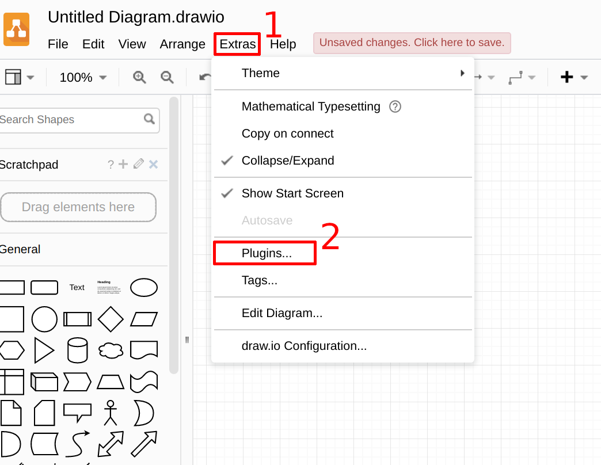
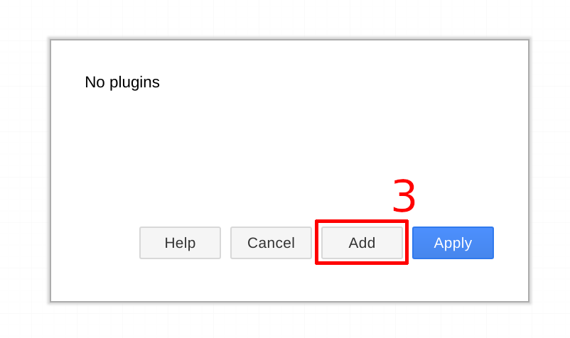
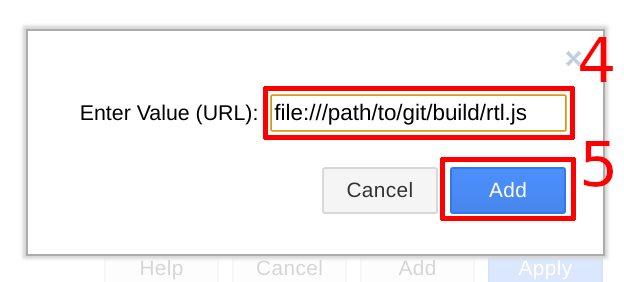
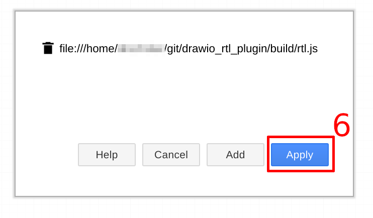
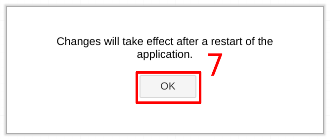

# drawio_rtl_plugin

## Installation

* clone repository

* start draw.io desktop
* click on `Extras` , then `Plugins...`

* click `Add`

* enter path to cloned git as `file://` uri and append `/build/rtl.js` and click `Add`

* check path and click `Apply`

* confirm dialog and restart draw.io

* if the RTL libraray does not appear on the left side (last entry)
  * check plugin dialog if path was saved
    * if not, remove the directory `~/.config/draw.io` und install again
